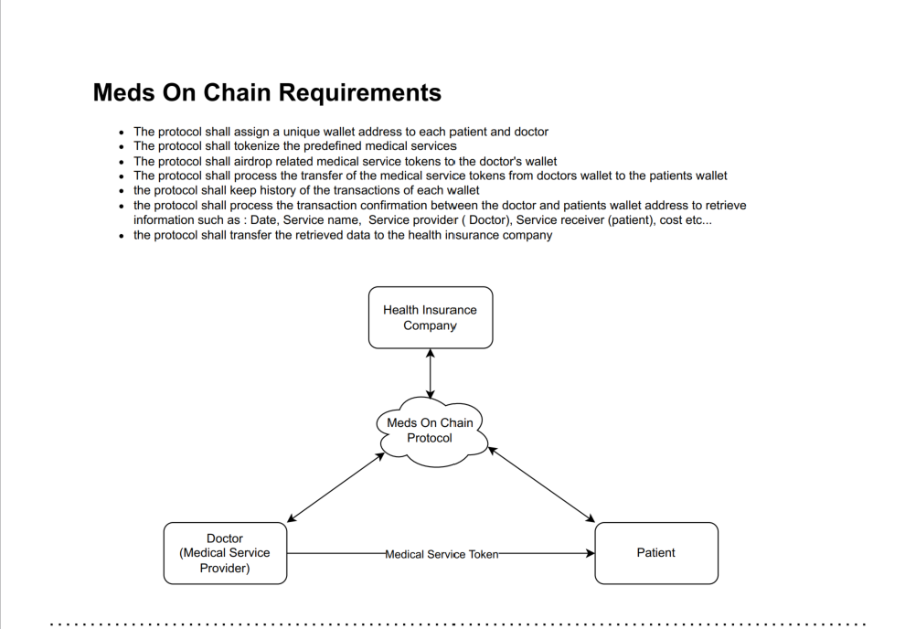
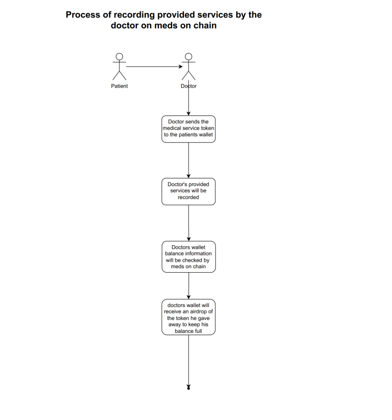
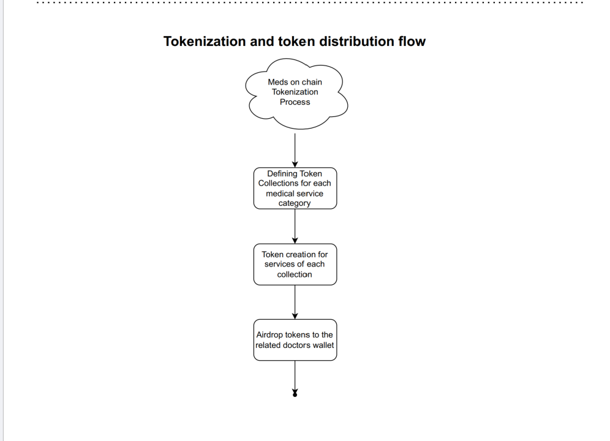

# Meds On Chain

Meds On Chain is a developing software solution designed for private health insurances to manage and process medical claims of patients instantly using blockchain technology. The platform aims to enhance transparency and efficiency in insurance claims processing, utilizing tokenized medical services and NFTs to verify service receipt and coverage details.

## Table of Contents

- [Project Overview](#project-overview)
- [User Stories](#user-stories)
- [Prerequisites](#prerequisites)
- [Installation](#installation)
- [Usage](#usage)
- [Testing](#testing)
- [Deployment](#deployment)


## Project Overview

### Project Name: Meds On Chain
**Date:** 02/11/2024

Meds On Chain leverages blockchain technology to tokenize medical services and streamline the insurance claims process. By creating verifiable and secure NFTs for medical services, the platform ensures transparent and efficient management of medical claims. it is important to state that not all the functionallity of the meds on chain platform are available now.



## User Stories

### User Story ID: MOC-01
#### User Persona
- **Name:** HealthSure Inc.
- **Role:** Health Insurance Provider
- **Goal:** Enhance transparency and efficiency of insurance claims processing and improve customer satisfaction through blockchain technology.

#### User Story
- As a health insurance provider (HealthSure Inc.), we want to use the Meds On Chain platform to tokenize medical services and verify the receipt of these services using NFTs. This will provide our customers with transparent coverage details and expedite claims processing.

#### Acceptance Criteria
- **Functionality:** Enable tokenization of medical services and real-time verification of service receipt and coverage details.
- **NFT Attributes:** Include information on medical service, provider, cost, and coverage percentage.
- **User Interaction:** Allow insurance companies, healthcare providers, and patients to interact with the platform to manage and verify medical service details and claims.
- **Security:** Ensure the integrity and security of NFTs and customer data, complying with data protection regulations.

### User Story ID: MOC-02
#### User Persona
- **Name:** Thomas
- **Role:** Privately insured patient
- **Goal:** Understand medical expenses coverage before treatment and have a fast and transparent billing process.

#### User Story
- As a privately insured patient in Germany (Thomas), I want to use my health insurance platform to see how much of the costs will be reimbursed when visiting a doctor. This ensures no unexpected expenses and a fast claims process.

#### Acceptance Criteria
- **Functionality:** See coverage percentage and fast claims process for medical bills.
- **NFT Attributes:** Represent medical services and coverage rate.
- **User Interaction:** Different interfaces for doctors and patients, with predefined coverage rates visible to patients.
- **Security:** Verifiable treatment NFTs, ensuring data protection and integrity.



### User Story ID: MOC-03
#### User Persona
- **Name:** Dr. Annika K.
- **Role:** Dermatologist
- **Goal:** Provide real-time financial cost clarity and improve patient follow-up.

#### User Story
- As a dermatologist (Dr. Annika), I want to use the Meds On Chain platform to clarify the financial costs of services and keep track of each patient visit. This improves patient follow-up on treatments.

#### Acceptance Criteria
- **Functionality:** Display real-time financial costs and keep records of patient visits.
- **NFT Attributes:** Each NFT represents a medical service with details such as description, cost, and insurance coverage percentage.
- **User Interaction:** Doctors and patients interact with NFTs to view service details and coverage information.
- **Security:** Verifiable and tamper-proof NFTs, with secure protection of patient and service data.




## Prerequisites

- **Rust** (version 1.79.0 or newer)
- **Solana CLI**
- **Node.js and npm**
- **Anchor CLI**

## Installation

1. **Clone the Repository**:
    ```sh
    git clone https://github.com/your-username/token_generator.git
    cd token_generator
    ```

2. **Install Dependencies**:
    ```sh
    npm install
    ```

3. **Set Up Rust**:
    Ensure you have Rust installed and set to the appropriate version:
    ```sh
    rustup default stable
    ```

## Usage

1. **Initialize Anchor**:
    ```sh
    anchor init token_generator
    cd token_generator
    ```

2. **Build the Project**:
    ```sh
    anchor build
    ```

3. **Deploy the Project**:
    ```sh
    anchor deploy
    ```

## Testing

1. **Run Tests**:
    ```sh
    anchor test
    ```

## Deployment

1. **Deploy to Solana**:
    Ensure your Solana cluster is set to `devnet` or `mainnet`:
    ```sh
    solana config set --url https://api.devnet.solana.com
    ```

    Deploy using Anchor:
    ```sh
    anchor deploy
    ```


